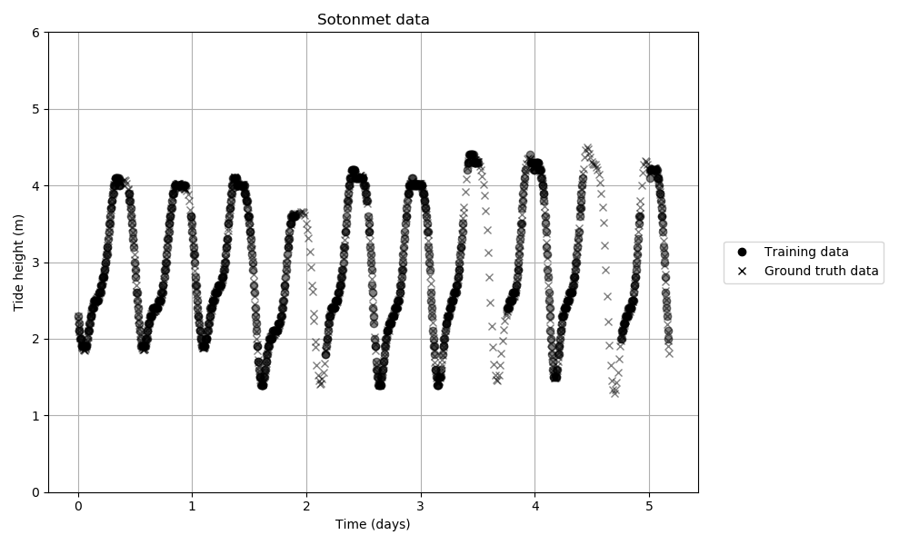
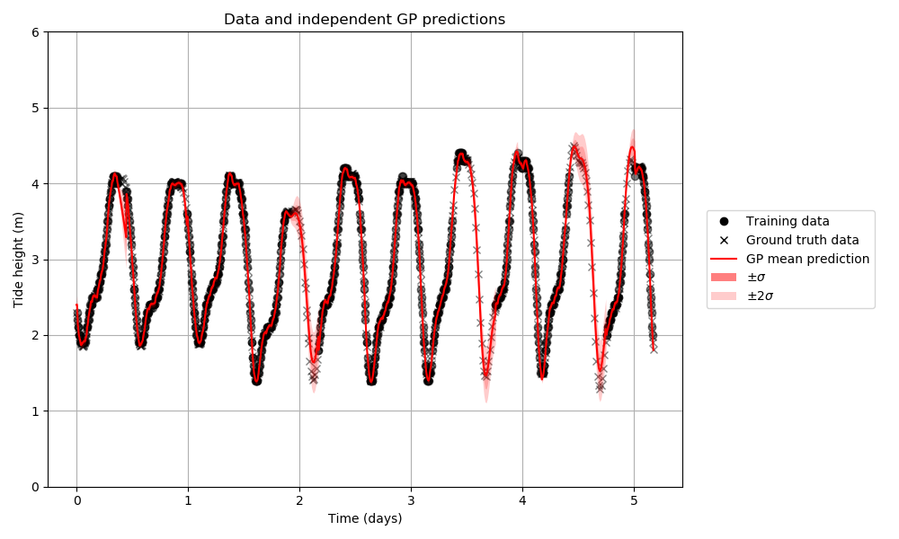
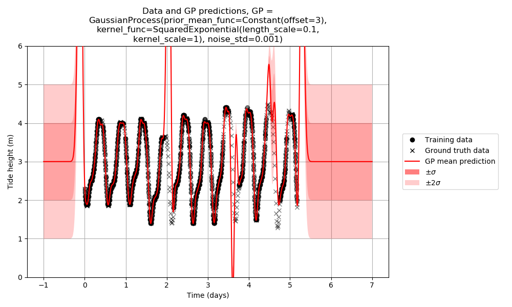
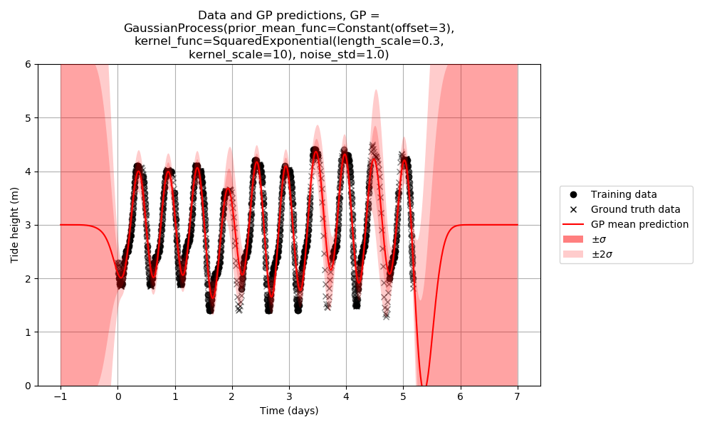
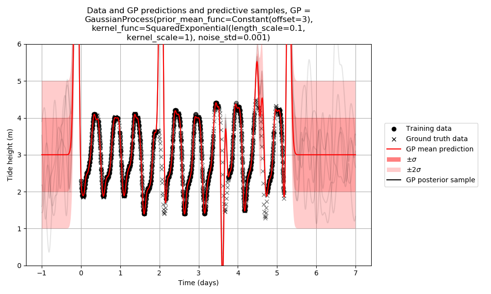
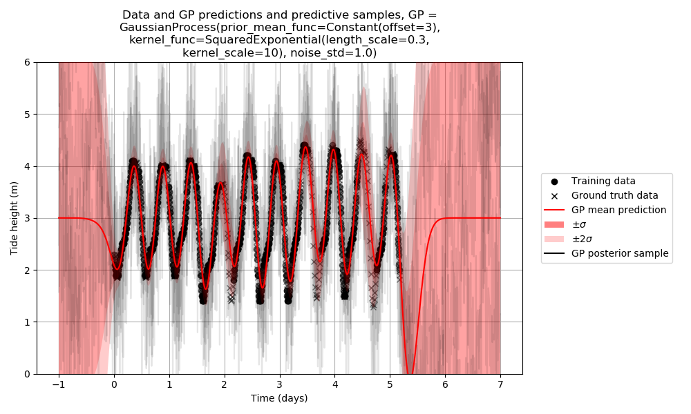
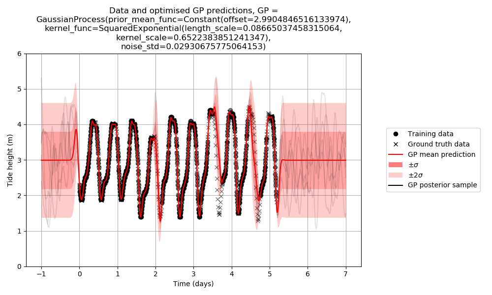

# Course 1 - Data, Estimation and Inference

The website for Michael Osborne's DEI lectures can be found [here](https://www.robots.ox.ac.uk/~mosb/aims_cdt/). The website for Tim Rudner's DEI lectures can be found [here](https://tgjr-research.notion.site/Data-Estimation-and-Inference-2022-GPs-c6e81b6fc2ec47f79140c42862d1cadd). This README describes solutions to the [coursework assigment](https://www.robots.ox.ac.uk/~mosb/teaching/AIMS_CDT/CDT_estimation_inference_lab.pdf) for this course, on the subject of Gaussian Processes.

## Contents

- [Course 1 - Data, Estimation and Inference](#course-1---data-estimation-and-inference)
  - [Contents](#contents)
  - [Loading and plotting data](#loading-and-plotting-data)
  - [Plotting samples from the GP prior](#plotting-samples-from-the-gp-prior)
  - [Plotting the GP predictive mean and standard deviation](#plotting-the-gp-predictive-mean-and-standard-deviation)
  - [Plotting samples from the GP predictive distribution](#plotting-samples-from-the-gp-predictive-distribution)
  - [Calculating RMSE, log marginal likelihood, and log predictive likelihood](#calculating-rmse-log-marginal-likelihood-and-log-predictive-likelihood)
  - [Optimising hyperparameters](#optimising-hyperparameters)
  - [Epistemic and aleatoric uncertainty](#epistemic-and-aleatoric-uncertainty)
  - [Periodic kernels](#periodic-kernels)
  - [Sum and product kernels](#sum-and-product-kernels)
  - [Sequential prediction](#sequential-prediction)
  - [Predicting gradients](#predicting-gradients)

## Loading and plotting data

Sotonmet (the dataset used in this assignment) can be loaded and plotted using the command `python scripts/course_1_dei/plot_data.py`. This produces the following figure:



This script also plots the independent GP predictions provided in `sotonmet.txt`, shown below:



## Plotting samples from the GP prior

Samples from the prior of a Gaussian Process can be plotted using the command `python scripts/course_1_dei/plot_prior_samples.py`. Samples from 2 different Gaussian Processes (each with a squared exponential kernel) are shown below:


## Plotting the GP predictive mean and standard deviation

The mean and standard deviation of the predictive distribution of a Gaussian Process can be plotted using the command `python scripts/course_1_dei/plot_gp_predictions.py`. The predictive distributions of 2 different Gaussian Processes (with identical parameters to the 2 Gaussian Processes used for plotting samples from the prior distribution above) are shown below. Note that, although the first Gaussian Process produces a *prior* distribution which looks like a more plausible explanation for the training data, the second Gaussian Process produces a *predictive* distribution which looks like a much better fit to the training data.





## Plotting samples from the GP predictive distribution

Joint samples from the predictive distribution of a Gaussian process can be plotted using the command `python scripts/course_1_dei/plot_predictive_samples.py`. Joint samples from the predictive distributions of the same 2 Gaussian Processes are shown below. Note that, although the first Gaussian Process produces a *prior* distribution which looks like a plausible explanation for the training data, and the second Gaussian Process produces a *predictive* distribution which looks like a good fit to the training data, neither Gaussian Process produces a joint predictive distribution whose *samples* look like a plausible explanation for the training data.





## Calculating RMSE, log marginal likelihood, and log predictive likelihood

The RMSE, log marginal likelihood, and log predictive likelihood can be printed by running the command `python scripts/course_1_dei/print_likelihoods.py`. The output for the same 2 Gaussian Processes is shown below. Note that although the first Gaussian process has a very low RMSE evaluated on the training data, it has an RMSE which is 30x higher when evaluated on the ground truth data, which is to say that the first Gaussian Process overfits the training data very badly, which is reflected in the significantly worse marginal and predictive likelihoods when compared to the second Gaussian process. The second Gaussian process has worse RMSE on the training data than the first Gaussian Process, but better RMSE on the ground truth data, which is to say that the second Gaussian process generalises better to the ground truth data, and this is reflected in the better marginal and predictive likelihoods of the second Gaussian process.

```
$ python scripts/course_1_dei/print_likelihoods.py
GaussianProcess(prior_mean_func=Constant(offset=3), kernel_func=SquaredExponential(length_scale=0.1, kernel_scale=1), noise_std=0.001)
RMSE (train) = 0.026773
RMSE (truth) = 0.804001
Log marginal likelihood = -327743.802128
Log predictive likelihood = -87596.252923
Log predictive likelihood (train) = -321611.898886
Log predictive likelihoods (truth subsets) = [-71286.49205436907, -70791.55218104349, -69201.39767392409, -72901.750074576, -67057.98517408842]

GaussianProcess(prior_mean_func=Constant(offset=3), kernel_func=SquaredExponential(length_scale=0.3, kernel_scale=10), noise_std=1.0)
RMSE (train) = 0.224601
RMSE (truth) = 0.257348
Log marginal likelihood = -941.950765
Log predictive likelihood = -894.297501
Log predictive likelihood (train) = -875.394063
Log predictive likelihoods (truth subsets) = [-881.0536967813545, -881.2814887339877, -881.2690405818164, -881.9491977973705, -882.3644788024241]
```

## Optimising hyperparameters

The log marginal likelihood can be used to optimise the hyperparameters of a Gaussian process. Starting with the 2nd Gaussian process above (the one with the higher marginal likelihood out of the 2 Gaussian processes considered so far), described by the string `GaussianProcess(prior_mean_func=Constant(offset=3), kernel_func=SquaredExponential(length_scale=0.3, kernel_scale=10), noise_std=1.0)`, the parameters of this Gaussian process can be optimised by running the command `python scripts/course_1_dei/find_best_params.py` (this command takes about 26 seconds to run), leading to a Gaussian process described by the string `GaussianProcess(prior_mean_func=Constant(offset=2.9904846516133974), kernel_func=SquaredExponential(length_scale=0.08665037458315064, kernel_scale=0.6522383851241347), noise_std=0.02930675775064153)`, whose log marginal likelihood is equal to 1574.440872 (increased from -941.950765). A summary of the Gaussian Processes considered so far and their resulting log marginal likelihoods is provided in the table below.

Gaussian Process description | Log marginal likelihood
--- | ---
`GaussianProcess(prior_mean_func=Constant(offset=3), kernel_func=SquaredExponential(length_scale=0.1, kernel_scale=1), noise_std=0.001)` | -327743.802128
`GaussianProcess(prior_mean_func=Constant(offset=3), kernel_func=SquaredExponential(length_scale=0.3, kernel_scale=10), noise_std=1.0)` | -941.950765
`GaussianProcess(prior_mean_func=Constant(offset=2.9904846516133974), kernel_func=SquaredExponential(length_scale=0.08665037458315064, kernel_scale=0.6522383851241347), noise_std=0.02930675775064153)` | 1574.440872

The predictions of the Gaussian Process with optimised hyperparameters are shown below.



## Epistemic and aleatoric uncertainty

## Periodic kernels

## Sum and product kernels

## Sequential prediction

## Predicting gradients
