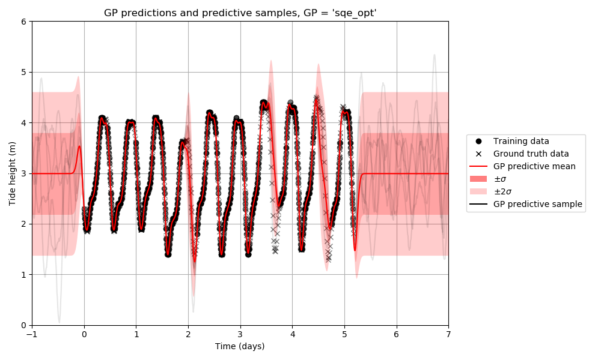
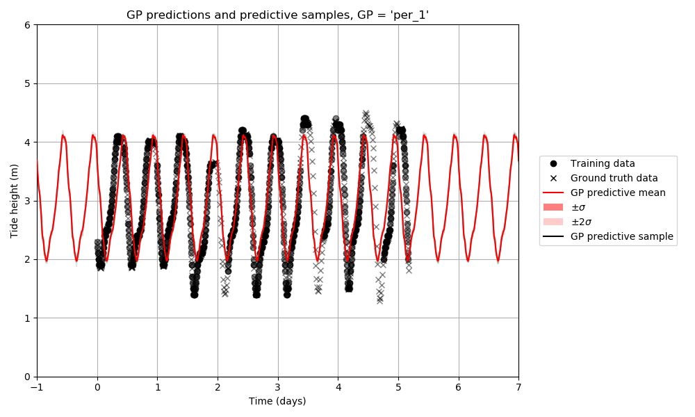
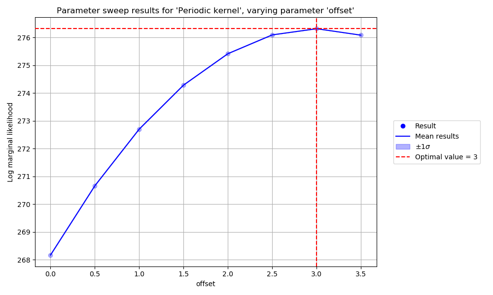
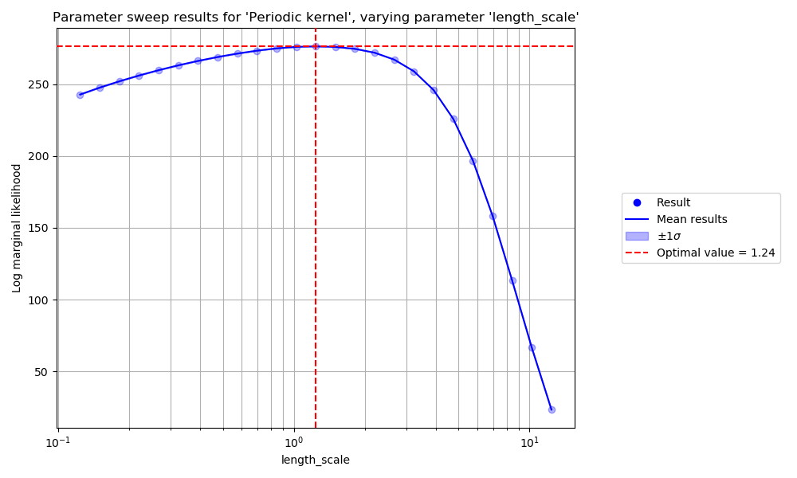

# Course 1 - Data, Estimation and Inference

The website for Michael Osborne's DEI lectures can be found [here](https://www.robots.ox.ac.uk/~mosb/aims_cdt/). The website for Tim Rudner's DEI lectures can be found [here](https://tgjr-research.notion.site/Data-Estimation-and-Inference-2022-GPs-c6e81b6fc2ec47f79140c42862d1cadd). This README describes solutions to the [coursework assigment](https://www.robots.ox.ac.uk/~mosb/teaching/AIMS_CDT/CDT_estimation_inference_lab.pdf) for this course, on the subject of Gaussian Processes.

## Contents

- [Course 1 - Data, Estimation and Inference](#course-1---data-estimation-and-inference)
  - [Contents](#contents)
  - [Loading and plotting data](#loading-and-plotting-data)
  - [Plotting samples from the GP prior](#plotting-samples-from-the-gp-prior)
  - [Plotting the GP predictive mean and standard deviation](#plotting-the-gp-predictive-mean-and-standard-deviation)
  - [Plotting samples from the GP predictive distribution](#plotting-samples-from-the-gp-predictive-distribution)
  - [Calculating RMSE, log marginal likelihood, and log predictive likelihood](#calculating-rmse-log-marginal-likelihood-and-log-predictive-likelihood)
  - [Hyperparameter optimisation](#hyperparameter-optimisation)
  - [Hyperparameter sensitivity](#hyperparameter-sensitivity)
  - [Epistemic and aleatoric uncertainty](#epistemic-and-aleatoric-uncertainty)
  - [Periodic kernels](#periodic-kernels)
  - [Sum and product kernels](#sum-and-product-kernels)
  - [Sequential prediction](#sequential-prediction)
  - [Predicting gradients](#predicting-gradients)

## Loading and plotting data

Sotonmet (the dataset used in this assignment) can be loaded and plotted using the command `python scripts/course_1_dei/plot_data.py`. This produces the following figure:


This script also plots the independent GP predictions provided in `sotonmet.txt`, shown below:


## Plotting samples from the GP prior

Samples from the prior of a Gaussian Process can be plotted using the command `python scripts/course_1_dei/plot_prior_samples.py`. Initially we consider 2 different Gaussian Processes, `sqe_1` and `sqe_2`, described in the table below:

GP name | GP description
--- | ---
`sqe_1` | `GaussianProcess(prior_mean_func=Constant(offset=3), kernel_func=SquaredExponential(length_scale=0.1, kernel_scale=1), noise_std=0.001)`
`sqe_2` | `GaussianProcess(prior_mean_func=Constant(offset=3), kernel_func=SquaredExponential(length_scale=0.3, kernel_scale=10), noise_std=1.0)`

Samples from `sqe_1` and `sqe_2` (which each use a squared exponential kernel) are shown below. Note that the prior distribution of `sqe_1` looks like a much more plausible explanation for the data:


## Plotting the GP predictive mean and standard deviation

The mean and standard deviation of the predictive distribution of a Gaussian Process can be plotted using the command `python scripts/course_1_dei/plot_gp_predictions.py`. The predictive distributions of `sqe_1` and `sqe_2` are shown below. Note that, although `sqe_1` produced a *prior* distribution which looks like a more plausible explanation for the training data, `sqe_2` produces a *predictive* distribution which looks like a much better fit to the training data. Furthermore, the predictive distribution of `sqe_1` is "confidently wrong" (the mean is far away from the ground truth labels and with high certainty/low standard deviation) in regions containing ground truth labels but no training data, which could be a very undesirable property to have in a safety-critical prediction scenario:


## Plotting samples from the GP predictive distribution

Joint samples from the predictive distribution of a Gaussian process can be plotted using the command `python scripts/course_1_dei/plot_predictive_samples.py`. Joint samples from the predictive distributions of `sqe_1` and `sqe_2` are shown below. Note that, although `sqe_1` produces a *prior* distribution which looks like a plausible explanation for the training data, and `sqe_2` produces a *predictive* distribution which looks like a good fit to the training data, neither Gaussian Process produces a joint predictive distribution whose *samples* look like a plausible explanation for the training data.


## Calculating RMSE, log marginal likelihood, and log predictive likelihood

The RMSE, log marginal likelihood, and log predictive likelihood can be printed by running the command `python scripts/course_1_dei/print_likelihoods.py`. The output for `sqe_1` and `sqe_2` is shown below. Note that although `sqe_1` has a very low RMSE evaluated on the training data, it has an RMSE which is 30x higher when evaluated on the ground truth data, which is to say that `sqe_1` overfits the training data very badly, which is reflected in the significantly worse marginal and predictive likelihoods when compared to the second Gaussian process. `sqe_2` has worse RMSE on the training data than the first Gaussian Process, but better RMSE on the ground truth data, which is to say that `sqe_2` generalises better to the ground truth data (although it does so with low confidence/high uncertainty), and this is reflected in the better marginal and predictive likelihoods of the second Gaussian process.

```
$ python scripts/course_1_dei/print_likelihoods.py
sqe_1
GaussianProcess(prior_mean_func=Constant(offset=3), kernel_func=SquaredExponential(length_scale=0.1, kernel_scale=1), noise_std=0.001)
RMSE (train) = 0.026773
RMSE (truth) = 0.804001
Log marginal likelihood = -327743.802128
Log predictive likelihood = -87596.252923
Log predictive likelihood (train) = -321611.898886
Log predictive likelihoods (truth subsets) = [-70744.57040334182, -69734.5348385596, -69641.87073220311, -66131.11803932585, -69388.783040178]

sqe_2
GaussianProcess(prior_mean_func=Constant(offset=3), kernel_func=SquaredExponential(length_scale=0.3, kernel_scale=10), noise_std=1.0)
RMSE (train) = 0.224601
RMSE (truth) = 0.257348
Log marginal likelihood = -941.950765
Log predictive likelihood = -894.297501
Log predictive likelihood (train) = -875.394063
Log predictive likelihoods (truth subsets) = [-881.3432355020102, -882.2694733003166, -881.03627091921, -881.5985634962216, -882.1593240818942]
```

## Hyperparameter optimisation

The log marginal likelihood can be used to optimise the hyperparameters of a Gaussian process. Starting with `sqe_2` (which has a higher marginal likelihood than `sqe_1`), the parameters of this Gaussian process can be optimised by running the command `python scripts/course_1_dei/find_best_params.py` (this command takes about 26 seconds to run), leading to a Gaussian process denoted `sqe_opt` and described by the string `GaussianProcess(prior_mean_func=Constant(offset=2.9904846516133974), kernel_func=SquaredExponential(length_scale=0.08665037458315064, kernel_scale=0.6522383851241347), noise_std=0.02930675775064153)`, whose log marginal likelihood is equal to 1574.440872 (increased from -941.950765). A summary of the Gaussian Processes considered so far and their resulting log marginal likelihoods is provided in the table below.

GP name | GP description | Log marginal likelihood
--- | --- | ---
`sqe_1` | `GaussianProcess(prior_mean_func=Constant(offset=3), kernel_func=SquaredExponential(length_scale=0.1, kernel_scale=1), noise_std=0.001)` | -649119.257386
`sqe_2` | `GaussianProcess(prior_mean_func=Constant(offset=3), kernel_func=SquaredExponential(length_scale=0.3, kernel_scale=10), noise_std=1.0)` | -1817.344828
`sqe_opt` | `GaussianProcess(prior_mean_func=Constant(offset=2.9904846516133974), kernel_func=SquaredExponential(length_scale=0.08665037458315064, kernel_scale=0.6522383851241347), noise_std=0.02930675775064153)` | 1574.440872

The predictions of `sqe_opt` can be plotted with the command `python scripts/course_1_dei/plot_predictive_samples.py`, and are shown below:



## Hyperparameter sensitivity

The sensitivity of the optimised Gaussian Process to the choice of hyperparameters can be investigated using the command `python scripts/course_1_dei/sweep_gp.py`, which produces the following images, demonstrating how the log maginal likelihood varies as a function of each individual hyperparameter while the other hyperparameters are kept equal to their optimal values, shown by the red dotted lines:


These images show that the log marginal likelihood is extremely sensitive to large values of `length_scale` and small values of `noise_std`, so zoomed in versions of these images are shown below for these 2 parameters:


## Epistemic and aleatoric uncertainty

To quote [Kendall, Alex, and Yarin Gal. "What uncertainties do we need in bayesian deep learning for computer vision?." Advances in neural information processing systems 30 (2017).](https://arxiv.org/abs/1703.04977):

> There are two major types of uncertainty one can model. Aleatoric uncertainty captures noise inherent in the observations. On the other hand, epistemic uncertainty accounts for uncertainty in the model - uncertainty which can be explained away given enough data.

We can model the performance of a GP in the presence of epistemic or aleatoric uncertainty by either removing or artificially adding noise to a restricted subsection of the data. For the case of the GP `sqe_opt` (which was optimised to have low marginal likelihood), this can be performed with the command `python scripts/course_1_dei/compare_epistemic_aleatoric_uncertainty.py`, and the results are shown in the figures below:


Although this GP performs well in the presence of epistemic uncertainty, reverting to a larger predictive standard deviation when far from the vicinity of any training data, we see that this GP does not perform well in the presence of aleatoric uncertainty, making confidently wrong predictions (predictions which are far away from the ground truth labels and with high certainty/low standard deviation) in the vicinity of training data with a high degree of noise.

We can understand this behaviour by looking at the expression for the predictive variance of the Gaussian Process, which depends only on the input locations of the training data and predictions, and not on the labels of the training data. Of course, the predictive variance of `sqe_opt` considered here depends indirectly on the training labels, as a result of its hyperparameters having been optimised with respect to the marginal likelihood of the training data, however this model has no capacity to increase its predictive uncertainty in the presence of new noisy training labels.

This could be a very undesirable property for the model to have in a safety-critical prediction scenario, for example if one of the input sensors failed and started producing very noisy measurements, we would not want the model to produce wildly incorrect predictions with a high degree of certainty, rather we would prefer the model to increase its predictive uncertainty to fit the uncertainty in the newly observed data. One possible solution to this problem would be to model the observation noise (which does directly affect the predictive uncertainty of a Gaussian Process) using the output from a second Gaussian Process, which predicts observation noise as a function of the same input data as the original Gaussian process, and conditions on the noise of the training data, however we leave this as a direction for future work.

## Periodic kernels

We define a new GP `per_1` with a periodic kernel, and set its hyperparameters to be identical to those of `sqe_opt`, except that the `period` hyperparameter is set to 0.5. The predictions and predictive samples of `per_1` are shown below:



We note that the predictive uncertainty of `per_1` is very low compared to `sqe_opt`, which has exactly the same parameters, with the exception that `per_1` has an additional `period` hyperparameter. We can understand this behaviour again by looking at the expression for the periodic kernel, and interpreting the behaviour in terms of epistemic uncertainty. To the periodic kernel, two training points might be separated by a long time lag, but they can be interpreted by the periodic kernel as occuring at the same (or nearby) input location if they are separated by an exact (or close to exact) integer multiple of the period. For the Sotonmet data considered here, the training data is spread over 10 periods of high/low tide, but to the periodic kernel, it would process the data in exactly the same way if all 917 training points were shifted by an integer multiple of the period to lie in the first half day, in which case we would would have a large number of training points all in a very close vicinity to each other. In the previous section, we saw that the predictive uncertainty increases when the number of nearby data points decreases (this is epistemic uncertainty), and here we see the inverse effect, that the predictive uncertainty decreases when, from the perspective of the kernel, the number of nearby data points increases. This explains why the predictive uncertainty of `per_1` is very low compared to `sqe_opt`.

We can optimise the hyperparameters of `per_1` using the command `python scripts/course_1_dei/find_best_params.py`, leading to a Gaussian Process referred to as `per_opt`. The log marginal likelihoods of all Gaussian Processes considered so far are shown in the table below. We see that `per_1` has a very bad marginal likelihood (worse than `sqe_2`, but not as bad as `sqe_1`), and that `per_opt` has a marginal likelihood which is better than `sqe_2`, but not as good as `sqe_opt`:

GP name | GP description | Log marginal likelihood
--- | --- | ---
`sqe_1` | `GaussianProcess(prior_mean_func=Constant(offset=3), kernel_func=SquaredExponential(length_scale=0.1, kernel_scale=1), noise_std=0.001)` | -649119.257386
`sqe_2` | `GaussianProcess(prior_mean_func=Constant(offset=3), kernel_func=SquaredExponential(length_scale=0.3, kernel_scale=10), noise_std=1.0)` | -1817.344828
`sqe_opt` | `GaussianProcess(prior_mean_func=Constant(offset=2.9904846516133974), kernel_func=SquaredExponential(length_scale=0.08665037458315064, kernel_scale=0.6522383851241347), noise_std=0.02930675775064153)` | 1574.440872
`per_1` | `GaussianProcess(prior_mean_func=Constant(offset=2.9904846516133974), kernel_func=Periodic(period=0.5, length_scale=0.08665037458315064, kernel_scale=0.6522383851241347), noise_std=0.02930675775064153)` | -142748.097076
`per_opt` | `GaussianProcess(prior_mean_func=Constant(offset=2.994526707406642), kernel_func=Periodic(period=0.5149342760919302, length_scale=1.2264134716027426, kernel_scale=1.0346460845353729), noise_std=0.17334345487465788)` | 276.323647

The predictions of `per_opt` can be plotted with the command `python scripts/course_1_dei/plot_predictive_samples.py`, and are shown below. We note that the predictive samples of `per_opt` have much better calibrated uncertainty than those of `per_1`, and that the optimised period is more well-aligned with the data. Again, the predictive standard deviation (plotted without observation noise) of `per_opt` is low relative to the data (because the training data points are all effectively very close together from the perspective of the periodic kernel), but the predictive samples (which include observation noise) have standard deviation which is more well calibrated with the training data:


The command `python scripts/course_1_dei/sweep_gp.py` can be used to plot the sensitivity of `per_opt` to its hyperparameters, and the resulting figures are shown below:







We note that the log marginal likelihood of `per_1` is very sensitive to and sharply peaked around its optimal value, so we provide a zoomed in version of this figure below:


In general, given the sensitivity and sharpness of the peak of the log marginal likelihood with respect to the period, it might be difficult for a gradient-based optimisation algorithm to find the optimal period. A possible solution to this problem would be to model the objective function using a second Gaussian process, and use Bayesian Optimisation [[Snoek, Jasper, Hugo Larochelle, and Ryan P. Adams. "Practical bayesian optimization of machine learning algorithms." Advances in neural information processing systems 25 (2012).](https://proceedings.neurips.cc/paper/2012/hash/05311655a15b75fab86956663e1819cd-Abstract.html)] to optimise the period, which would naturally spend more time searching in the vicinity of the peak, but this raises the question of how to optimise the hyperparameters of this second Gaussian Process - clearly we can't use a separate Bayesian Optimisation routine to optimise the hyperparameters of every Gaussian Process without ending up with an infinite number of Gaussian Processes.

## Sum and product kernels

## Sequential prediction

## Predicting gradients
