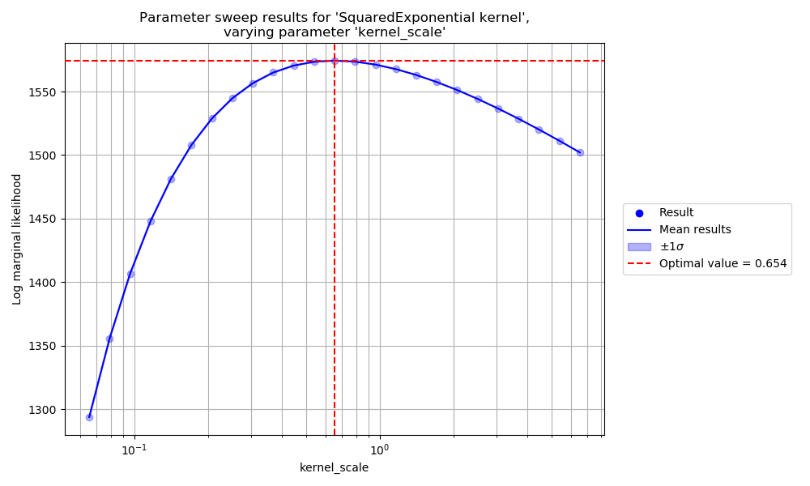

# Course 1 - Data, Estimation and Inference

The website for Michael Osborne's DEI lectures can be found [here](https://www.robots.ox.ac.uk/~mosb/aims_cdt/). The website for Tim Rudner's DEI lectures can be found [here](https://tgjr-research.notion.site/Data-Estimation-and-Inference-2022-GPs-c6e81b6fc2ec47f79140c42862d1cadd). This README describes solutions to the [coursework assigment](https://www.robots.ox.ac.uk/~mosb/teaching/AIMS_CDT/CDT_estimation_inference_lab.pdf) for this course, on the subject of Gaussian Processes.

## Contents

- [Course 1 - Data, Estimation and Inference](#course-1---data-estimation-and-inference)
  - [Contents](#contents)
  - [Loading and plotting data](#loading-and-plotting-data)
  - [Plotting samples from the GP prior](#plotting-samples-from-the-gp-prior)
  - [Plotting the GP predictive mean and standard deviation](#plotting-the-gp-predictive-mean-and-standard-deviation)
  - [Plotting samples from the GP predictive distribution](#plotting-samples-from-the-gp-predictive-distribution)
  - [Calculating RMSE, log marginal likelihood, and log predictive likelihood](#calculating-rmse-log-marginal-likelihood-and-log-predictive-likelihood)
  - [Hyperparameter optimisation](#hyperparameter-optimisation)
  - [Hyperparameter sensitivity](#hyperparameter-sensitivity)
  - [Epistemic and aleatoric uncertainty](#epistemic-and-aleatoric-uncertainty)
  - [Periodic kernels](#periodic-kernels)
  - [Sum and product kernels](#sum-and-product-kernels)
  - [Sequential prediction](#sequential-prediction)
  - [Predicting gradients](#predicting-gradients)

## Loading and plotting data

Sotonmet (the dataset used in this assignment) can be loaded and plotted using the command `python scripts/course_1_dei/plot_data.py`. This produces the following figure:


This script also plots the independent GP predictions provided in `sotonmet.txt`, shown below:


## Plotting samples from the GP prior

Samples from the prior of a Gaussian Process can be plotted using the command `python scripts/course_1_dei/plot_prior_samples.py`. Initially we consider 2 different Gaussian Processes, `sqe_1` and `sqe_2`, described in the table below:

GP name | GP description
--- | ---
`sqe_1` | `GaussianProcess(prior_mean_func=Constant(offset=3), kernel_func=SquaredExponential(length_scale=0.1, kernel_scale=1), noise_std=0.001)`
`sqe_2` | `GaussianProcess(prior_mean_func=Constant(offset=3), kernel_func=SquaredExponential(length_scale=0.3, kernel_scale=10), noise_std=1.0)`

Samples from `sqe_1` and `sqe_2` (which each use a squared exponential kernel) are shown below. Note that the prior distribution of `sqe_1` looks like a much more plausible explanation for the data:


## Plotting the GP predictive mean and standard deviation

The mean and standard deviation of the predictive distribution of a Gaussian Process can be plotted using the command `python scripts/course_1_dei/plot_gp_predictions.py`. The predictive distributions of `sqe_1` and `sqe_2` are shown below. Note that, although `sqe_1` produced a *prior* distribution which looks like a more plausible explanation for the training data, `sqe_2` produces a *predictive* distribution which looks like a much better fit to the training data. Furthermore, the predictive distribution of `sqe_1` is "confidently wrong" (the mean is far away from the ground truth labels and with high certainty/low standard deviation) in regions containing ground truth labels but no training data, which could be a very undesirable property to have in a safety-critical prediction scenario:


## Plotting samples from the GP predictive distribution

Joint samples from the predictive distribution of a Gaussian process can be plotted using the command `python scripts/course_1_dei/plot_predictive_samples.py`. Joint samples from the predictive distributions of `sqe_1` and `sqe_2` are shown below. Note that, although `sqe_1` produces a *prior* distribution which looks like a plausible explanation for the training data, and `sqe_2` produces a *predictive* distribution which looks like a good fit to the training data, neither Gaussian Process produces a joint predictive distribution whose *samples* look like a plausible explanation for the training data.


## Calculating RMSE, log marginal likelihood, and log predictive likelihood

The RMSE, log marginal likelihood, and log predictive likelihood can be printed by running the command `python scripts/course_1_dei/print_likelihoods.py`. The output for `sqe_1` and `sqe_2` is shown below. Note that although `sqe_1` has a very low RMSE evaluated on the training data, it has an RMSE which is 30x higher when evaluated on the ground truth data, which is to say that `sqe_1` overfits the training data very badly, which is reflected in the significantly worse marginal and predictive likelihoods when compared to the second Gaussian process. `sqe_2` has worse RMSE on the training data than the first Gaussian Process, but better RMSE on the ground truth data, which is to say that `sqe_2` generalises better to the ground truth data (although it does so with low confidence/high uncertainty), and this is reflected in the better marginal and predictive likelihoods of the second Gaussian process.

```
$ python scripts/course_1_dei/print_likelihoods.py
sqe_1
GaussianProcess(prior_mean_func=Constant(offset=3), kernel_func=SquaredExponential(length_scale=0.1, kernel_scale=1), noise_std=0.001)
RMSE (train) = 0.026773
RMSE (truth) = 0.804001
Log marginal likelihood = -327743.802128
Log predictive likelihood = -87596.252923
Log predictive likelihood (train) = -321611.898886
Log predictive likelihoods (truth subsets) = [-70744.57040334182, -69734.5348385596, -69641.87073220311, -66131.11803932585, -69388.783040178]

sqe_2
GaussianProcess(prior_mean_func=Constant(offset=3), kernel_func=SquaredExponential(length_scale=0.3, kernel_scale=10), noise_std=1.0)
RMSE (train) = 0.224601
RMSE (truth) = 0.257348
Log marginal likelihood = -941.950765
Log predictive likelihood = -894.297501
Log predictive likelihood (train) = -875.394063
Log predictive likelihoods (truth subsets) = [-881.3432355020102, -882.2694733003166, -881.03627091921, -881.5985634962216, -882.1593240818942]
```

## Hyperparameter optimisation

The log marginal likelihood can be used to optimise the hyperparameters of a Gaussian process. Starting with `sqe_2` (which has a higher marginal likelihood than `sqe_1`), the parameters of this Gaussian process can be optimised by running the command `python scripts/course_1_dei/find_best_params.py` (this command takes about 26 seconds to run), leading to a Gaussian process denoted `sqe_opt` and described by the string `GaussianProcess(prior_mean_func=Constant(offset=2.9904846516133974), kernel_func=SquaredExponential(length_scale=0.08665037458315064, kernel_scale=0.6522383851241347), noise_std=0.02930675775064153)`, whose log marginal likelihood is equal to 1574.440872 (increased from -941.950765). A summary of the Gaussian Processes considered so far and their resulting log marginal likelihoods is provided in the table below.

GP name | GP description | Log marginal likelihood
--- | --- | ---
`sqe_1` | `GaussianProcess(prior_mean_func=Constant(offset=3), kernel_func=SquaredExponential(length_scale=0.1, kernel_scale=1), noise_std=0.001)` | -649119.257386
`sqe_2` | `GaussianProcess(prior_mean_func=Constant(offset=3), kernel_func=SquaredExponential(length_scale=0.3, kernel_scale=10), noise_std=1.0)` | -1817.344828
`sqe_opt` | `GaussianProcess(prior_mean_func=Constant(offset=2.9904846516133974), kernel_func=SquaredExponential(length_scale=0.08665037458315064, kernel_scale=0.6522383851241347), noise_std=0.02930675775064153)` | 1574.440872

The predictions of `sqe_opt` can be plotted with the command `python scripts/course_1_dei/plot_predictive_samples.py`, and are shown below:


## Hyperparameter sensitivity

The sensitivity of the optimised Gaussian Process to the choice of hyperparameters can be investigated using the command `python scripts/course_1_dei/sweep_gp.py`, which produces the following images, demonstrating how the log maginal likelihood varies as a function of each individual hyperparameter while the other hyperparameters are kept equal to their optimal values, shown by the red dotted lines:





These images show that the log marginal likelihood is extremely sensitive to large values of `length_scale` and small values of `noise_std`, so zoomed in versions of these images are shown below for these 2 parameters:


## Epistemic and aleatoric uncertainty

To quote [Kendall, Alex, and Yarin Gal. "What uncertainties do we need in bayesian deep learning for computer vision?." Advances in neural information processing systems 30 (2017).](https://arxiv.org/abs/1703.04977):

> There are two major types of uncertainty one can model. Aleatoric uncertainty captures noise inherent in the observations. On the other hand, epistemic uncertainty accounts for uncertainty in the model - uncertainty which can be explained away given enough data.

We can model the performance of a GP in the presence of epistemic or aleatoric uncertainty by either removing or artificially adding noise to a restricted subsection of the data. For the case of the GP `sqe_opt` (which was optimised to have low marginal likelihood), this can be performed with the command `python scripts/course_1_dei/compare_epistemic_aleatoric_uncertainty.py`, and the results are shown in the figures below:


Although this GP performs well in the presence of epistemic uncertainty, reverting to a larger predictive standard deviation when far from the vicinity of any training data, we see that this GP does not perform well in the presence of aleatoric uncertainty, making confidently wrong predictions (predictions which are far away from the ground truth labels and with high certainty/low standard deviation) in the vicinity of training data with a high degree of noise.

We can understand this behaviour by looking at the expression for the predictive variance of the Gaussian Process, which depends only on the input locations of the training data and predictions, and not on the labels of the training data. Of course, the predictive variance of `sqe_opt` considered here depends indirectly on the training labels, as a result of its hyperparameters having been optimised with respect to the marginal likelihood of the training data, however this model has no capacity to increase its predictive uncertainty in the presence of new noisy training labels.

This could be a very undesirable property for the model to have in a safety-critical prediction scenario, for example if one of the input sensors failed and started producing very noisy measurements, we would not want the model to produce wildly incorrect predictions with a high degree of certainty, rather we would prefer the model to increase its predictive uncertainty to fit the uncertainty in the newly observed data. One possible solution to this problem would be to model the observation noise (which does directly affect the predictive uncertainty of a Gaussian Process) using the output from a second Gaussian Process, which predicts observation noise as a function of the same input data as the original Gaussian process, and conditions on the noise of the training data, however we leave this as a direction for future work.

## Periodic kernels

## Sum and product kernels

## Sequential prediction

## Predicting gradients
