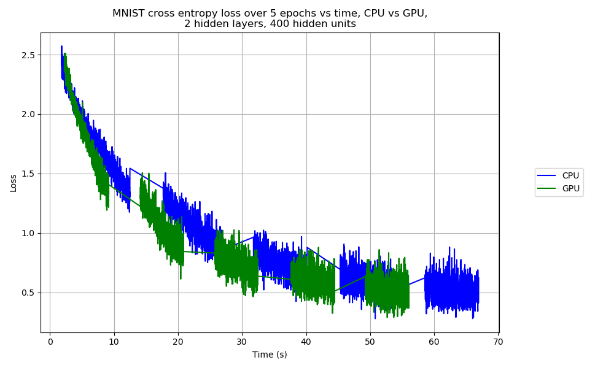
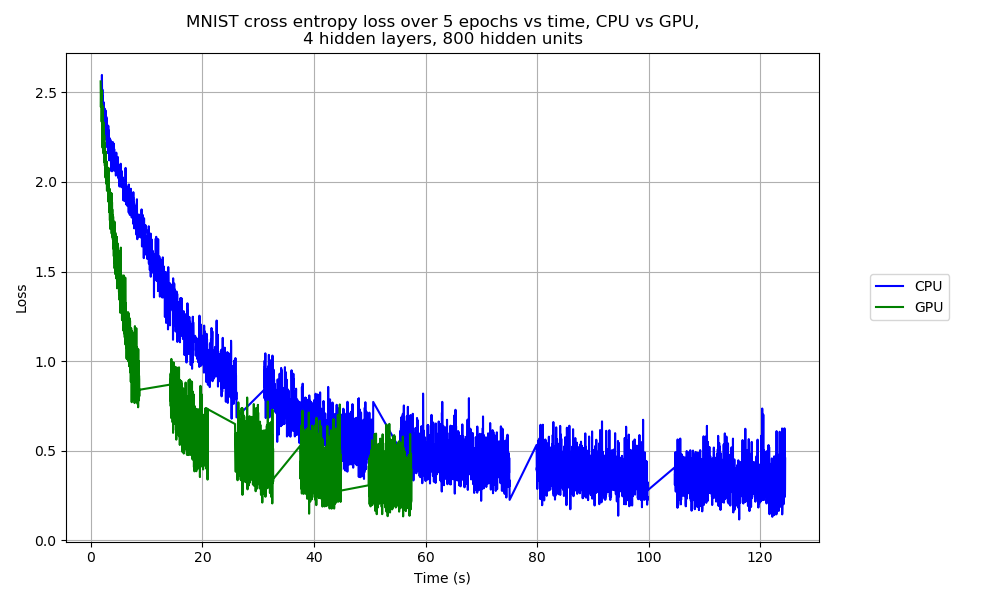
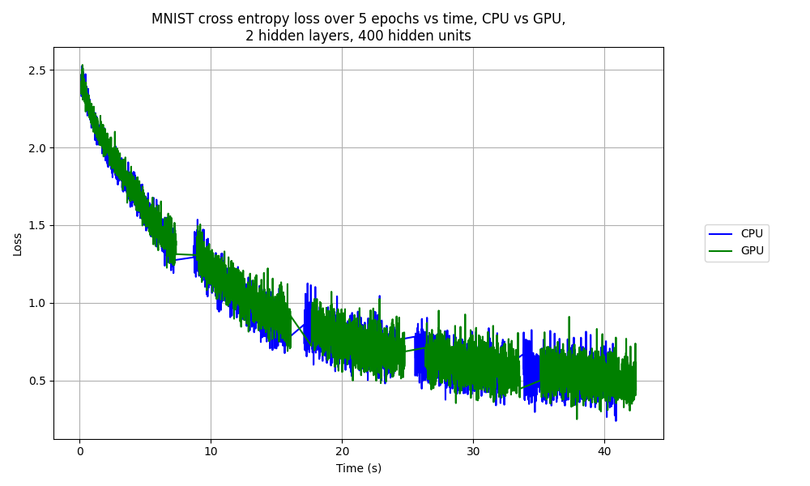
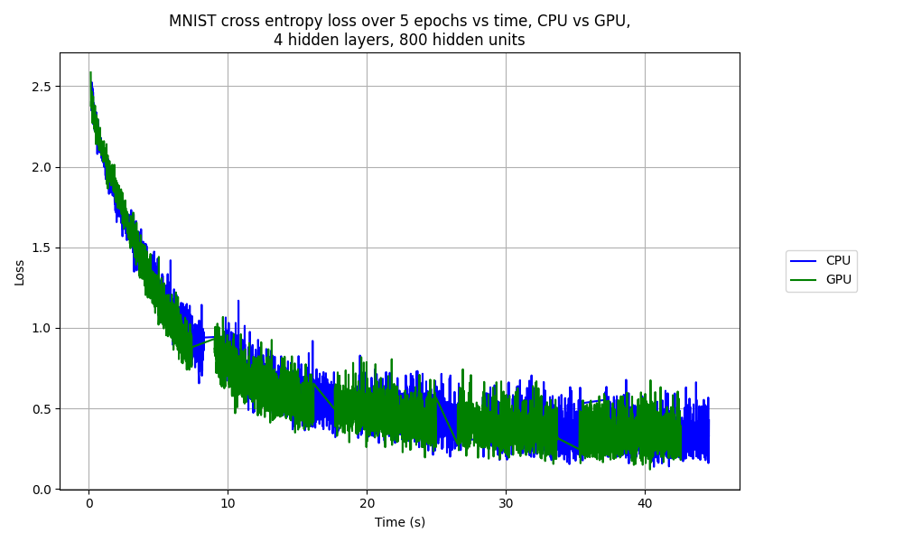
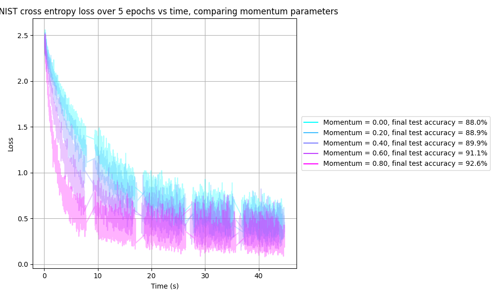
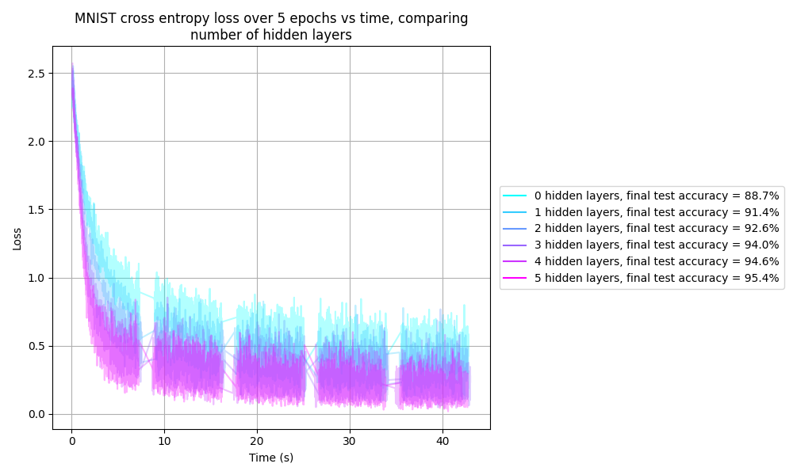

# Machine Learning Assignment

## Contents

- [Machine Learning Assignment](#machine-learning-assignment)
  - [Contents](#contents)
  - [Introduction](#introduction)
  - [Comparing CPU vs GPU](#comparing-cpu-vs-gpu)
  - [Comparing momentum parameters](#comparing-momentum-parameters)
  - [Comparing number of hidden layers](#comparing-number-of-hidden-layers)

## Introduction

The instructions for this assignment can be found [here](https://github.com/gbaydin/ml-aims-mt2022/tree/main/assessed-assignment).

## Comparing CPU vs GPU

The script `scripts/course_4_ml/assignment/compare_cpu_gpu.py` compares inference with a MLP on MNIST on the CPU and GPU, for 2 different sized models, and runs in about 5 minutes 40.9 seconds. The plots below show the comparison for a MLP with 2 hidden layers and 400 hidden units per layer, and with 4 hidden layers and 800 hidden units per layer, respectively, running on a laptop with an NVIDIA GeForce MX250 GPU. The GPU offers a speed-up for training in both cases, but the speed-up is much more significant for the larger model. Interestingly, there doesn't appear to be as much speed up for test set evaluations, presumably because the GPU speed benefit is offset by copying data from CPU to GPU.

The test set prediction accuracies after each epoch for the 4 training sessions are summarised in the table below:

Number of epochs | Small model, CPU | Large model, CPU | Small model, GPU | Large model, GPU
--- | --- | --- | --- | ---
0 |  7.990% |  8.750% |  7.990% |  8.750%
1 | 73.790% | 82.690% | 73.860% | 82.390%
2 | 82.310% | 87.600% | 82.330% | 87.380%
3 | 85.130% | 89.750% | 85.070% | 89.550%
4 | 86.900% | 90.740% | 86.930% | 90.600%
5 | 88.070% | 91.480% | 88.020% | 91.430%

The time taken for each of the 4 training sessions is summarised in the table below:

Small model, CPU | Large model, CPU | Small model, GPU | Large model, GPU
--- | --- | --- | ---
1 minutes 10.1 seconds | 2 minutes 7.7 seconds | 59.2 seconds | 1 minutes 3.2 seconds

Below are equivalent results when running the same script on a server using an NVIDIA TITAN V GPU:

## Comparing momentum parameters

The following shows a comparison in the learning curves for different momentum parameters, running on the server using the NVIDIA TITAN V GPU:

## Comparing number of hidden layers

The following shows a comparison in the learning curves for different numbers of hidden layers:

