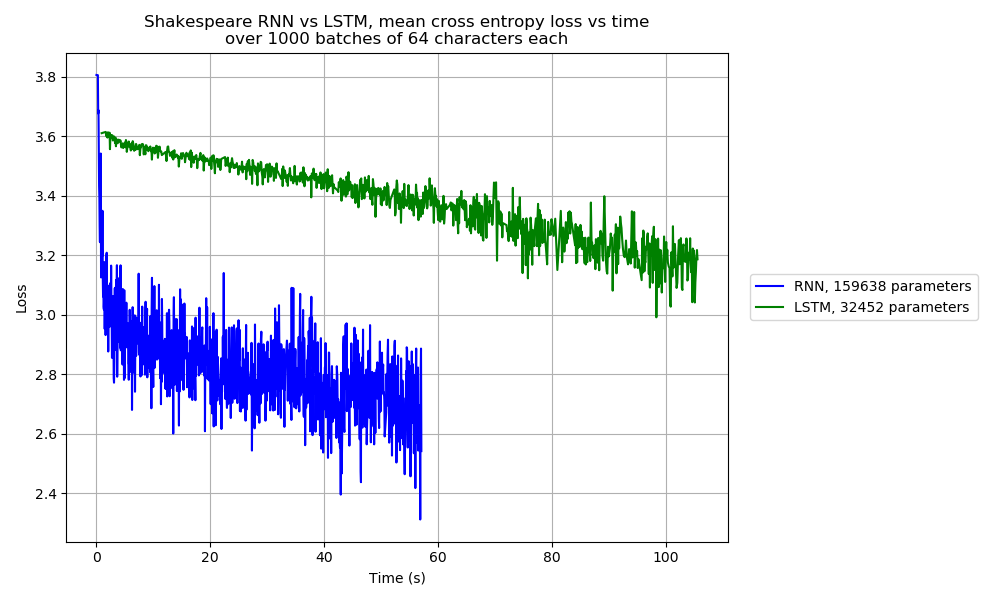

# Machine Learning Assignment

## Contents

- [Machine Learning Assignment](#machine-learning-assignment)
  - [Contents](#contents)
  - [Introduction](#introduction)
  - [Visualising predictions](#visualising-predictions)
  - [Comparing CPU vs GPU](#comparing-cpu-vs-gpu)
  - [Comparing momentum parameters](#comparing-momentum-parameters)
  - [Comparing number of hidden layers](#comparing-number-of-hidden-layers)
  - [Comparing dimension of hidden layers](#comparing-dimension-of-hidden-layers)
  - [Comparing batch sizes](#comparing-batch-sizes)
  - [Comparing activation functions](#comparing-activation-functions)
  - [Adversarial examples](#adversarial-examples)
  - [Training an RNN on the works of Shakespeare](#training-an-rnn-on-the-works-of-shakespeare)
  - [Comparing LSTM vs RNN on the works of Shakespeare](#comparing-lstm-vs-rnn-on-the-works-of-shakespeare)

## Introduction

The instructions for this assignment can be found [here](https://github.com/gbaydin/ml-aims-mt2022/tree/main/assessed-assignment).

## Visualising predictions

Shown below are predictions for one example of each digit in the MNIST test set, from a MLP trained for 5 epochs on the MNIST training set, with 2 hidden layers, 400 hidden units per layer, Relu activation functions applied to the output of each hidden layer, trained with stochastic gradient descent (SGD) with a momentum parameter of 0.8:

## Comparing CPU vs GPU

The script `scripts/course_4_ml/assignment/compare_cpu_gpu.py` compares inference with a MLP on MNIST on the CPU and GPU, for 2 different sized models, and runs in about 5 minutes 40.9 seconds. The plots below show the comparison for a MLP with 2 hidden layers and 400 hidden units per layer, and with 4 hidden layers and 800 hidden units per layer, respectively, running on a laptop with an NVIDIA GeForce MX250 GPU. The GPU offers a speed-up for training in both cases, but the speed-up is much more significant for the larger model. Interestingly, there doesn't appear to be as much speed up for test set evaluations, presumably because the GPU speed benefit is offset by copying data from CPU to GPU.

The test set prediction accuracies after each epoch for the 4 training sessions are summarised in the table below:

Number of epochs | Small model, CPU | Large model, CPU | Small model, GPU | Large model, GPU
--- | --- | --- | --- | ---
0 |  7.990% |  8.750% |  7.990% |  8.750%
1 | 73.790% | 82.690% | 73.860% | 82.390%
2 | 82.310% | 87.600% | 82.330% | 87.380%
3 | 85.130% | 89.750% | 85.070% | 89.550%
4 | 86.900% | 90.740% | 86.930% | 90.600%
5 | 88.070% | 91.480% | 88.020% | 91.430%

The time taken for each of the 4 training sessions is summarised in the table below:

Small model, CPU | Large model, CPU | Small model, GPU | Large model, GPU
--- | --- | --- | ---
1 minutes 10.1 seconds | 2 minutes 7.7 seconds | 59.2 seconds | 1 minutes 3.2 seconds

Below are equivalent results when running the same script on a server using an NVIDIA TITAN V GPU:

## Comparing momentum parameters

The following shows a comparison in the learning curves for different momentum parameters, running on the server using the NVIDIA TITAN V GPU:

## Comparing number of hidden layers

The following shows a comparison in the learning curves for different numbers of hidden layers:

## Comparing dimension of hidden layers

The following shows a comparison in the learning curves for different numbers of hidden units per hidden layer:

## Comparing batch sizes

The following shows a comparison in the learning curves for different batch sizes:

## Comparing activation functions

The following shows a comparison in the learning curves for different activation functions:

## Adversarial examples

The script `scripts/course_4_ml/assignment/adversarial_example.py` can be used to generate adversarial examples, for example:

Below is the training curve for the loss function between the prediction and the adversarial target vs iteration:

## Training an RNN on the works of Shakespeare

The script `scripts/course_4_ml/assignment/compare_rnn_cpu_gpu.py` trains an RNN on the works of Shakespeare, and compares the time taken between CPU and GPU. The results from running this script on a laptop with an NVIDIA GeForce MX250 GPU are shown below:

## Comparing LSTM vs RNN on the works of Shakespeare

The script `scripts/course_4_ml/assignment/compare_rnn_lstm.py` trains both a LSTM and a RNN on the works of Shakespeare, and compares the learning curves. The results from running this script on a laptop with an NVIDIA GeForce MX250 GPU are shown below:

In the image above, the performance of the LSTM is not as good as the RNN, but the LSTM also has many fewer parameters. The following image shows the results of an experiment which is the same as the previous one, except every MLP in the LSTM has 2 hidden layers instead of 1:

The following image shows the results of an experiment which is the same as the previous one, except every MLP in the LSTM has 2 hidden layers instead of 1 and also three times as many hidden units in every hidden layer, and the hidden and cell states are also three times larger:

